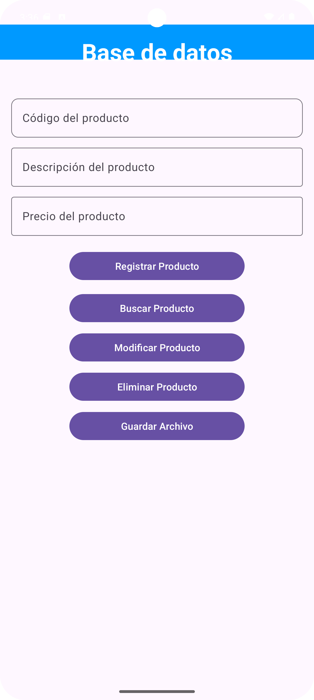
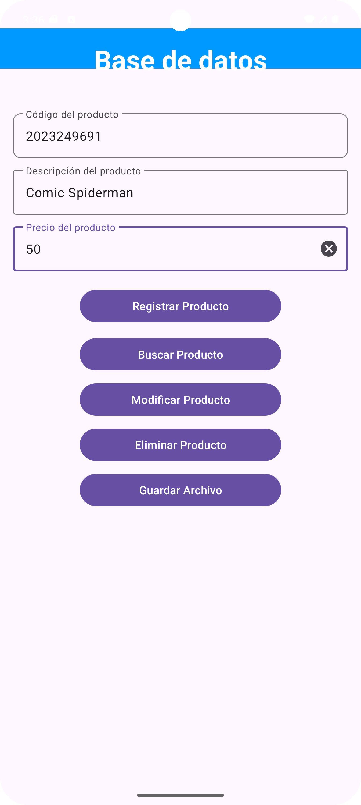
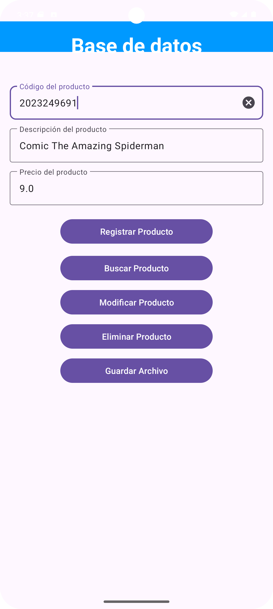
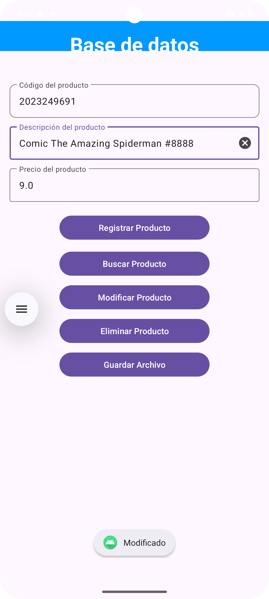
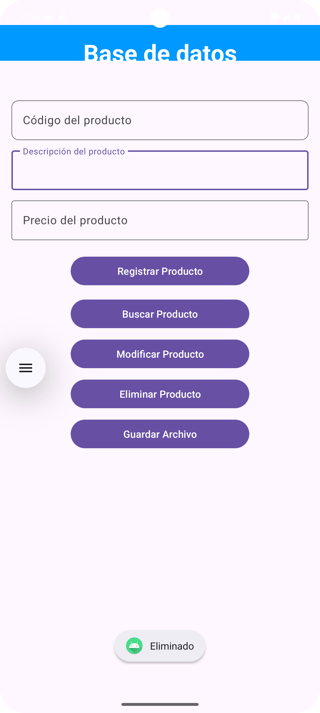

# Práctica 07 - Base de Datos con Room

## Descripción
Aplicación móvil desarrollada en Android Studio utilizando Kotlin y Room para realizar operaciones CRUD sobre productos. Además, se implementó almacenamiento externo, Flow y Repository.

---

## Interfaz Principal

**Pantalla principal**  

---

## Registro de Productos

**Registro exitoso**  

---

## Búsqueda de Productos

**Buscar producto**  

---

## Modificación de Productos

**Modificar producto**  

---

## Eliminación de Productos

**Eliminar producto**  

---

## Tecnologías Utilizadas

- Kotlin
- Android Studio
- Room Database
- SQLite
- Coroutines
- Flow
- Material Design 3

---

## Autor

César Yana
